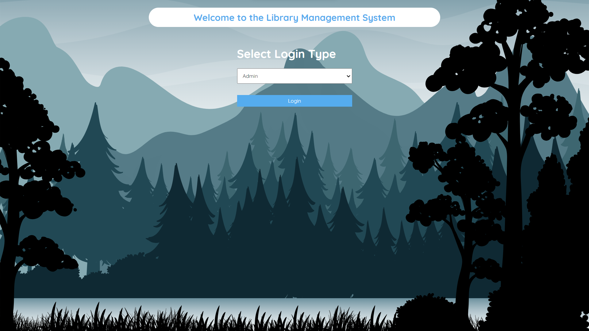
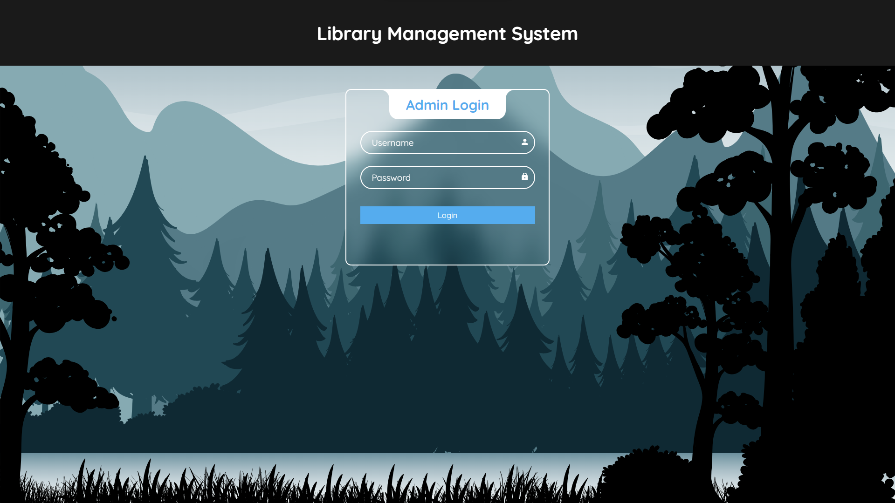
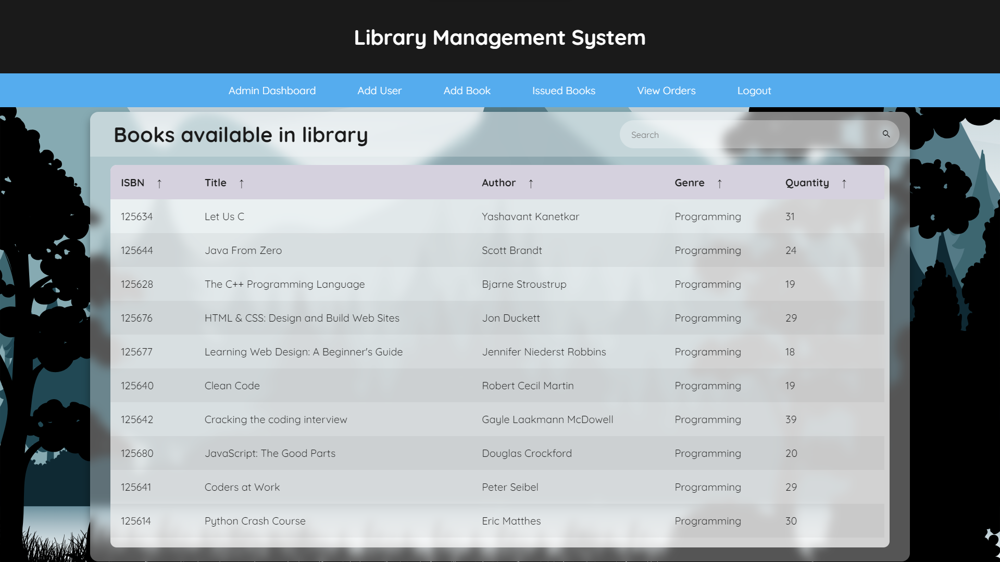
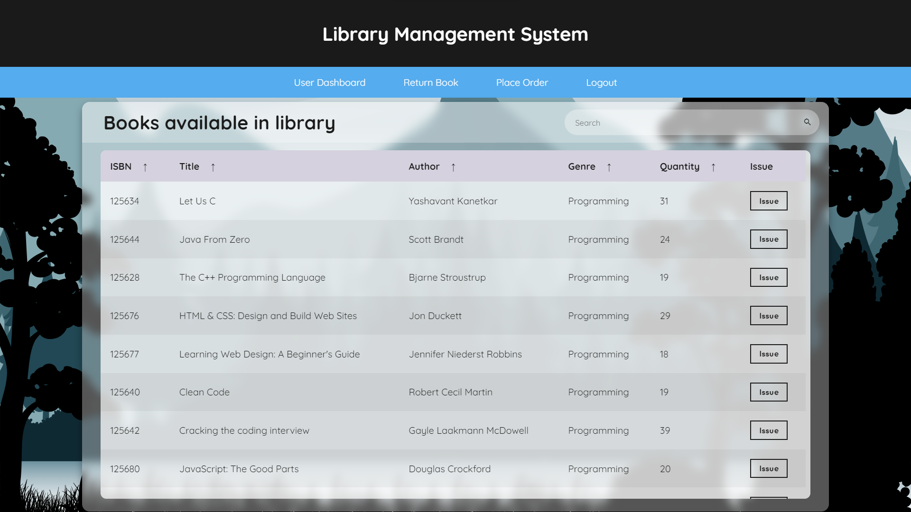
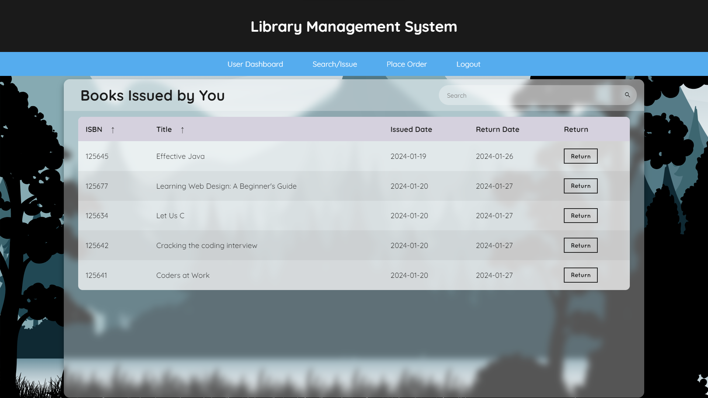

# Library Management System

[](https://www.python.org/)
[](https://flask.palletsprojects.com/)
[](https://www.mysql.com/)
[](https://docs.pytest.org/)
[](https://www.selenium.dev/)
[](https://github.com/guptasajal244/library-management-system/actions)

A complete, beginner-friendly web application for managing library inventory and borrow workflows. Built with **Flask** and **MySQL**, the project includes separate administrative and user interfaces, an automated database setup and seeding script, a robust **Selenium automation test suite** with **pytest**, and a fully integrated **GitHub Actions CI/CD pipeline** for headless browser testing.

---

## 🚀 Key Features

### 👤 User Portal
* **Browse Book Catalog:** Search for books by title, author, or genre.
* **Borrowing Lifecycle:** Issue available books (up to 6 books per account) and return them.
* **Order Placement:** Request or pre-order specific books if they are currently unavailable.

### 🛡️ Admin Portal
* **Inventory Control:** Add new books with validation for unique ISBNs and positive quantities.
* **Member Management:** Create and manage regular user accounts.
* **System Logs & Tracking:** Monitor currently issued books, view user orders, and view inventory summaries.

### 🧪 Automated Testing & QA
* **End-to-End browser tests** using Selenium WebDriver and pytest.
* **Robust Alert Interceptor:** Prevents headless Chrome from silently suppressing alerts, ensuring stable AJAX workflows.
* **Database Setup Automation:** Initializes schema and seeds admin/user credentials dynamically.
* **Headless execution support** for speed and remote CI workflows.

---

## 🛠️ Technology Stack

| Component | Technology | Description |
| :--- | :--- | :--- |
| **Backend** | Python & Flask | Core routing, business logic, session management |
| **Database** | MySQL | Persistent store for books, users, borrow records, and orders |
| **ORM** | Flask-SQLAlchemy | Database schema definition and query builder |
| **Authentication** | Flask-Login & Bcrypt | Safe session handling and password hashing |
| **Frontend** | HTML5, CSS3, JS (Vanilla) | Interactive pages, form validation, and Fetch API |
| **Testing Framework** | pytest | Test runner with custom markers (`smoke`, `ajax`, `admin`, `user`) |
| **Browser Automation** | Selenium WebDriver | End-to-end user path simulation in Chrome |
| **CI/CD** | GitHub Actions | Automatic unit, database, and headless browser testing on push |

---

## 📂 Project Structure

```text
Library-Management-System/
├── .github/workflows/
│   └── ci.yml                # CI configuration (MySQL service container + Headless tests)
├── screenshots/              # Application screenshots for presentation
├── static/                   # CSS stylesheets, images, and browser JS
├── templates/                # Jinja2 HTML templates
├── tests/
│   ├── conftest.py           # Shared pytest fixtures (driver, login helpers, alert interceptors)
│   ├── db_setup.py           # Database table creation and user/admin seeding script
│   ├── requirements-test.txt # Packages required strictly for automated testing
│   ├── test_add_book.py      # E2E Selenium tests for admin book management
│   ├── test_issue_return.py  # E2E Selenium tests for user borrow/return AJAX flows
│   └── test_smoke.py         # Smoke tests checking landing pages, logins, and logouts
├── app.py                    # Main Flask application entry point
├── createDB.txt              # Raw SQL commands for manual database setup
├── modelsDB.py               # ORM database models mapping
├── pytest.ini                # Pytest configuration file (folders, custom markers)
├── requirements.txt          # Python dependencies for the core Flask app
└── README.md                 # Project documentation
```

---

## 💻 Installation & Local Setup

Follow these steps to get the application running on your local machine:

### 1. Prerequisites
Ensure you have the following installed and added to your system's `PATH`:
* **Python 3.8+** ([Download](https://www.python.org/downloads/))
* **MySQL Server 8.0+** ([Download](https://www.mysql.com/downloads/))

Verify their installation from your terminal:
```bash
python --version
mysql --version
```

### 2. Clone the Repository
Clone the project to your local directory:
```bash
git clone https://github.com/guptasajal244/library-management-system.git
cd library-management-system
```

### 3. Create & Activate Virtual Environment
Create a virtual environment (`venv`) to isolate dependencies:
```bash
# Create virtual environment
python -m venv venv

# Activate on Windows (Command Prompt)
venv\Scripts\activate

# Activate on Windows (PowerShell)
.\venv\Scripts\activate.ps1

# Activate on macOS/Linux
source venv/bin/activate
```

### 4. Install Dependencies
Install packages for the core app and the testing suite:
```bash
# Install core Flask and database packages
pip install -r requirements.txt

# Install Selenium and testing packages
pip install -r tests/requirements-test.txt
```

### 5. Configure the Database
You can initialize and configure your database using one of two methods:

#### Method A: Automatic Setup & Seeding (Recommended)
This script connects to your MySQL server, creates the `library` database schema, and seeds default user and administrator credentials:

1. Make sure your MySQL Server is running locally.
2. If you are using the default MySQL username (`root`) and password (`root`), you can run the setup script directly. If your password differs, set your `DATABASE_URL` environment variable first:
   ```bash
   # Windows Command Prompt
   set DATABASE_URL=mysql+pymysql://<user>:<password>@localhost/<db_name>

   # PowerShell
   $env:DATABASE_URL="mysql+pymysql://<user>:<password>@localhost/<db_name>"

   # macOS/Linux
   export DATABASE_URL="mysql+pymysql://<user>:<password>@localhost/<db_name>"
   ```
3. Run the setup command:
   ```bash
   python tests/db_setup.py
   ```

#### Method B: Manual Configuration
1. Open your MySQL client and create a database named `library`:
   ```sql
   CREATE DATABASE library;
   ```
2. Apply the tables and default SQL inserts provided in [createDB.txt](createDB.txt).

### 6. Run the Application
Start the local Flask development server:
```bash
python app.py
```
Open your browser and navigate to `http://127.0.0.1:5000/`.

---

## 🧪 Running Automation Tests

The project includes an extensive Selenium test suite run via `pytest`. **Webdriver Manager** is configured to automatically download and run the correct Chrome driver version matching your browser.

> [!IMPORTANT]
> Ensure the Flask application is running in a separate terminal (`python app.py`) before executing these tests.

### Default Login Credentials (Seeded by `db_setup.py`)
* **Admin Portal:** Username: `admin` | Password: `admin`
* **User Portal:** Username: `sajal` | Password: `admin`

### Run in Headful (GUI) Mode
Runs Chrome visibly on your desktop so you can watch the test actions:
```bash
pytest
```

### Run in Headless (Background) Mode
Executes Chrome in the background without launching a window. Useful for quick tests or environments without graphical interfaces:
```bash
# Windows Command Prompt
set HEADLESS=true && pytest

# PowerShell
$env:HEADLESS="true"; pytest

# macOS/Linux
HEADLESS=true pytest
```

### Run Specific Test Modules or Tags
You can execute specific tests using custom markers defined in `pytest.ini`:
```bash
# Run only quick smoke/sanity checks
pytest -m smoke -v

# Run admin tests (Adding books, parameter validation, etc.)
pytest -m admin -v

# Run user-only workflow tests (Catalog browse, issue/return)
pytest -m user -v

# Run tests involving AJAX dialogs and JavaScript alerts
pytest -m ajax -v
```

---

## ⚙️ GitHub Actions CI/CD Pipeline

The repository includes a configured workflow in [.github/workflows/ci.yml](.github/workflows/ci.yml) that triggers on every push and pull request to the `main` branch.

### Workflow Execution Steps
1. **Container Setup:** Spins up a service container running **MySQL 8.0** with custom root credentials.
2. **Environment Setup:** Checks out the code and installs Python 3.10 with pip caching enabled.
3. **Dependency Installation:** Installs native MySQL development headers (`libmysqlclient-dev`), core Python dependencies, and testing tools.
4. **Database Automation:** Runs `tests/db_setup.py` against the MySQL container to initialize tables and seed credentials.
5. **App Bootstrap:** Launches the Flask server in the background and uses a polling script to ensure the port (`5000`) is active.
6. **Automation Execution:** Executes `pytest` with headless Chrome parameters, running the entire automation suite end-to-end.

---

## 📸 Screenshots

Below are screenshots showing the responsive design and various user/administrator flows:

### INDEX


### ADMIN LOGIN


### USER LOGIN


### VIEW BOOKS


### ISSUE BOOKS


### RETURN BOOKS


---

## 🔮 Future Improvements
* **Pagination:** Implement server-side pagination for book listing and orders.
* **Password Reset:** Add email verification or admin-assisted password reset flows.
* **Self-Registration:** Allow external users to sign up and wait for admin approval.
* **Return Due-Date Alerts:** Notify users via email when a book's return date is approaching.
